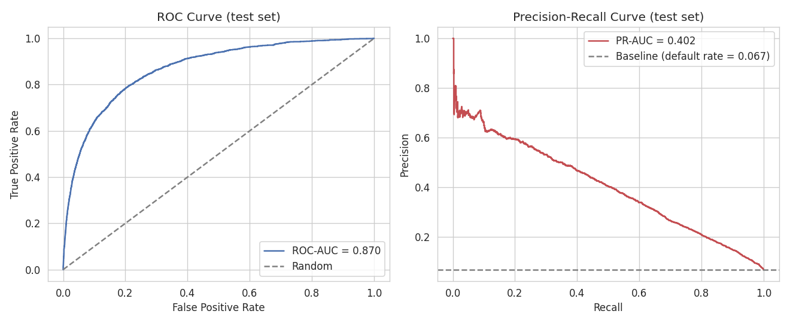
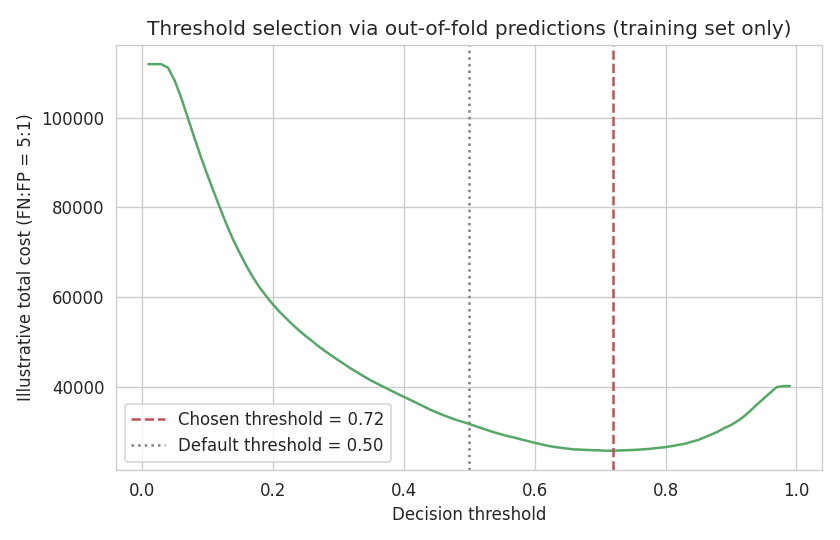
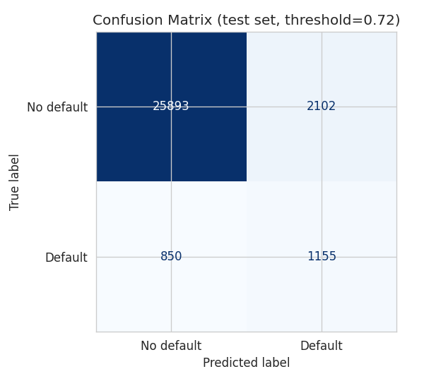
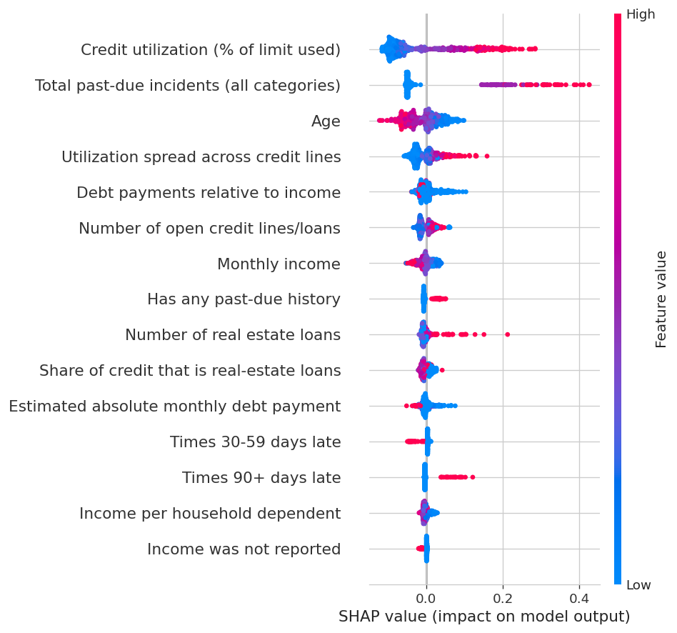

# Credit Risk Scoring — Predicting Serious Delinquency

End-to-end machine learning project that predicts the probability a borrower
will experience serious credit delinquency (90+ days past due) within the
next two years, based on the Kaggle **"Give Me Some Credit"** dataset.

> **At a glance:** 4 models × 2 imbalance strategies compared via 5-fold CV → LightGBM + class
> weighting wins → Optuna-tuned → evaluated once on a held-out test set (**ROC-AUC 0.870, PR-AUC
> 0.402**) → decision threshold chosen via a cost-driven analysis, not the default 0.5 → SHAP
> explanations for individual clients, including one the model got wrong. Full write-up below;
> [What to discuss in an interview](#what-to-discuss-in-an-interview) has the short version.

## Table of contents

- [Problem statement](#problem-statement)
- [Data](#data)
- [Project structure](#project-structure)
- [Approach](#approach)
- [Results](#results)
- [Final test-set evaluation](#final-test-set-evaluation-srcevaluatepy)
- [Interpretability](#interpretability-srcinferencepy-shap)
- [How to run](#how-to-run)
- [What to discuss in an interview](#what-to-discuss-in-an-interview)

## Problem statement

Banks need to estimate, at the moment of underwriting, how likely a borrower
is to default so they can price risk correctly and set responsible lending
limits. This project frames that as a **binary classification** problem:
given a snapshot of a borrower's credit profile, predict the probability of
serious delinquency within 2 years.

The target class is heavily imbalanced (defaults are a small minority of the
population), which shapes almost every methodological decision in this
project: which metrics are meaningful, how models are validated, and how
class imbalance itself is handled.

## Data

Source: [Kaggle — Give Me Some Credit](https://www.kaggle.com/c/GiveMeSomeCredit)

The competition provides `cs-training.csv` (labeled) and `cs-test.csv`
(unlabeled, used only for the original Kaggle leaderboard). This project uses
**only `cs-training.csv`**, split ourselves into train/test — `cs-test.csv`
has no ground-truth labels available, so it can't be used for honest offline
evaluation.

**Raw features:**

| Column | Description |
|---|---|
| `SeriousDlqin2yrs` | **Target.** 1 = borrower had 90+ days past-due delinquency within 2 years |
| `RevolvingUtilizationOfUnsecuredLines` | Total balance on credit cards / personal lines, divided by sum of credit limits |
| `age` | Age of borrower (years) |
| `NumberOfTime30-59DaysPastDueNotWorse` | Times borrower was 30–59 days past due |
| `DebtRatio` | Monthly debt payments + living costs, divided by monthly gross income |
| `MonthlyIncome` | Monthly income |
| `NumberOfOpenCreditLinesAndLoans` | Number of open loans and credit lines |
| `NumberOfTimes90DaysLate` | Times borrower was 90+ days late |
| `NumberRealEstateLoansOrLines` | Number of mortgage / real estate loans |
| `NumberOfTime60-89DaysPastDueNotWorse` | Times borrower was 60–89 days past due |
| `NumberOfDependents` | Number of dependents |

Because of Kaggle's terms, the raw CSV is **not committed** to this repo
(see `.gitignore`). To reproduce: download `cs-training.csv` from the
competition page above and place it at `data/raw/cs-training.csv`.

## Project structure

```
credit-risk-scoring/
├── data/
│   ├── raw/              # cs-training.csv goes here (not committed)
│   └── processed/        # cleaned / feature-engineered data (not committed)
├── models/                # trained model artifacts (final_model.joblib)
├── notebooks/
│   ├── 01_eda.ipynb              # exploratory data analysis
│   └── 02_results_and_shap_demo.ipynb # final results + SHAP demo
├── reports/
│   └── figures/          # exported plots used in this README
├── src/
│   ├── config.py               # paths, column names, constants
│   ├── data_preprocessing.py   # loading, cleaning, missing values, outliers
│   ├── feature_engineering.py  # engineered features, encoding, scaling
│   ├── train_models.py         # CV comparison, imbalance handling, Optuna tuning
│   ├── evaluate.py             # metrics, plots (ROC/PR curves, confusion matrix)
│   └── inference.py            # predict() for a single new client + SHAP explanation
├── tests/
├── requirements.txt
└── README.md
```

## Approach

1. **EDA** — distributions, correlations, missing values, outliers.
2. **Feature engineering** — missing value handling, engineered ratios
   (e.g. debt-to-income), outlier treatment.
3. **Class imbalance** — class weighting vs. SMOTE, compared head-to-head.
4. **Models** — Logistic Regression (baseline), Random Forest, XGBoost,
   LightGBM, compared via stratified k-fold CV.
5. **Metrics** — ROC-AUC, PR-AUC, Precision, Recall, F1 (rationale for
   imbalanced classification below).
6. **Hyperparameter tuning** — Optuna on the best-performing model family.
7. **Interpretability** — SHAP (global + per-client local explanations).

### Why not just accuracy?

With defaults being a small minority of the dataset, a model predicting
"never default" for everyone would already score high accuracy while being
useless for risk decisions. ROC-AUC and PR-AUC (more sensitive to performance
on the minority class), along with Precision/Recall/F1 at a chosen decision
threshold, give a much more honest picture. This is discussed in more detail
in `notebooks/01_eda.ipynb` and `src/evaluate.py`.

### Key EDA findings (full detail in `notebooks/01_eda.ipynb`)

- **`96`/`98` in the three "days past due" count columns is a sentinel/error code, not a real count** —
  it appears across all three columns for the same ~269 rows, and that subset has a **~55% default rate
  vs. ~6.7% overall**. Rather than drop these as bad data, `DataCleaner` captures the pattern in a binary
  flag (`had_past_due_sentinel_code`) and imputes the underlying columns with their clean median.
- **`MonthlyIncome` missingness (~20% of rows) is informative, not random** — ~94% of rows with missing
  income also have `DebtRatio > 1`, suggesting `DebtRatio` may hold a different quantity when income
  wasn't captured. Handled with a `monthly_income_missing` flag plus median imputation.
- **`RevolvingUtilizationOfUnsecuredLines`** and **`DebtRatio`** have extreme long right tails (max
  ~50,708 and ~329,664 vs. an expected range around 0–2) — winsorized at the 97.5th percentile learned
  on the training data, rather than an arbitrary hand-picked cutoff.
- A single **`age == 0`** row is treated as missing and imputed like any other value.

### Engineered features (`src/feature_engineering.py`)

Built on top of the cleaned columns, each with a Pearson correlation against the target observed on
the training set:

| Feature | Formula | Corr. with target |
|---|---|---|
| `total_past_due_count` | sum of the three past-due count columns | **+0.39** |
| `has_any_past_due` | 1 if `total_past_due_count > 0` | **+0.31** |
| `utilization_x_credit_lines` | `RevolvingUtilization * NumberOfOpenCreditLinesAndLoans` | +0.19 |
| `age_group` | ordinal bucket: <30 / 30-45 / 45-60 / 60+ | −0.11 |
| `income_per_dependent` | `MonthlyIncome / (NumberOfDependents + 1)` | −0.03 |
| `estimated_monthly_debt_payment` | `DebtRatio * MonthlyIncome` | −0.02 |
| `real_estate_loan_share` | `NumberRealEstateLoansOrLines / (NumberOfOpenCreditLinesAndLoans + 1)` | −0.01 |

Worth being upfront about: `estimated_monthly_debt_payment` was hypothesized to correlate *positively*
with default (higher absolute debt burden → more risk), but shows a weak negative correlation instead —
likely because it's dominated by the income term rather than isolating debt burden. It's kept in the
feature set (regularization / tree feature importance will naturally downweight it if it's not useful),
but this is flagged here rather than only in code comments, since not every engineered feature works out
as hypothesized, and that's a normal, honest part of the process.

## Results

5-fold stratified cross-validation on the training set (120,000 rows), all 8 (model × imbalance
strategy) configurations, sorted by PR-AUC (the primary selection criterion — see rationale in
`src/train_models.py`):

| Model | Imbalance strategy | ROC-AUC | PR-AUC | Precision | Recall | F1 |
|---|---|---|---|---|---|---|
| **LightGBM** | **class_weight** | **0.863** | **0.396** | 0.224 | 0.758 | 0.346 |
| Logistic Regression | class_weight | 0.857 | 0.381 | 0.216 | 0.750 | 0.335 |
| Logistic Regression | SMOTE | 0.856 | 0.379 | 0.215 | 0.753 | 0.335 |
| LightGBM | SMOTE | 0.856 | 0.379 | 0.534 | 0.238 | 0.329 |
| XGBoost | class_weight | 0.842 | 0.363 | 0.238 | 0.674 | 0.352 |
| XGBoost | SMOTE | 0.849 | 0.360 | 0.521 | 0.212 | 0.301 |
| Random Forest | class_weight | 0.834 | 0.340 | 0.539 | 0.148 | 0.232 |
| Random Forest | SMOTE | 0.832 | 0.321 | 0.455 | 0.257 | 0.328 |

**Winner: LightGBM + class weighting.** Full numbers in `reports/model_comparison.csv`, selection saved
to `reports/best_config.json` — used automatically by the hyperparameter tuning step.

### Class weights vs. SMOTE — what actually happened

The two strategies affect precision/recall very differently, and not in the same direction for every
model:

- For every model, **class weighting pushes recall way up and precision down** relative to SMOTE (e.g.
  LightGBM: recall 0.758 vs. 0.238). This makes sense mechanistically — class weighting changes the
  *loss function* directly, penalizing missed defaults heavily, which shifts predicted probabilities
  broadly upward and, at a fixed 0.5 threshold, flags far more borrowers as risky.
- SMOTE only *rebalances the training data*, it doesn't reweight the loss — so at the same 0.5
  threshold, tree models trained on SMOTE-resampled data behave more conservatively (higher precision,
  much lower recall).
- **ROC-AUC and PR-AUC are similar or slightly better for class weighting** across models here, meaning
  the *ranking* quality is comparable-to-better even though the two strategies produce very different
  behavior at a fixed threshold. This is exactly why threshold-independent metrics (ROC-AUC / PR-AUC) are
  used to pick the winning configuration, while precision/recall are reported for context rather than as
  the selection criterion — the "right" threshold is a business decision (e.g. cost of a missed default
  vs. cost of an unnecessarily declined loan), made in `evaluate.py`, not baked into model selection.
- **Random Forest was both the weakest performer and by far the slowest** (87–172s per fold vs. 2–13s
  for the boosting models) even at a modest 100 trees — a useful, honest data point for why gradient
  boosting is the practical default for tabular data like this.

### Hyperparameter tuning (Optuna)

Tuned the winning configuration (LightGBM + class weighting) with a 30-trial Optuna study (TPE sampler),
using the **same 5-fold CV + PR-AUC objective** as the comparison stage above, for a consistent
end-to-end criterion:

| | CV PR-AUC | 
|---|---|
| Default hyperparameters (100 estimators, LightGBM defaults) | 0.3956 |
| **Optuna-tuned (30 trials)** | **0.4018** |

Best parameters found: `n_estimators=108`, `num_leaves=67`, `max_depth=5`, `learning_rate=0.055`,
`min_child_samples=43`, `subsample=0.87`, `colsample_bytree=0.82`, `reg_alpha=0.075`, `reg_lambda=6.14`.
Full trial history is in `reports/optuna_study.db` (inspectable with `optuna-dashboard
sqlite:///reports/optuna_study.db` if you want to explore it visually), search space and objective
function in `src/train_models.py`.

The gain from tuning here is modest (+1.6% relative PR-AUC) rather than dramatic — worth being honest
about: LightGBM's defaults are already quite strong on tabular data like this, so tuning refines rather
than transforms performance. The final model is fit with these tuned parameters on the **full** training
set (all 120,000 rows) and saved to `models/final_model.joblib`. As a sanity check on the untouched test
set (30,000 rows, evaluated once): **ROC-AUC = 0.870, PR-AUC = 0.402** — consistent with the CV estimate,
confirming no leakage or overfitting crept in. The full evaluation (threshold selection, confusion
matrix, ROC/PR curve plots) is below.

## Final test-set evaluation (`src/evaluate.py`)

Evaluated **once**, on the 30,000-row test set that had never been used for any modeling decision up to
this point (not for model selection, not for tuning, not for threshold selection):



- **ROC-AUC: 0.870**
- **PR-AUC: 0.402**

### Choosing a decision threshold without touching the test set

The default 0.5 threshold is arbitrary — it implicitly assumes a missed default and a wrongly-declined
borrower cost the lender the same amount, which isn't true in practice (a missed default typically loses
a large share of the loan principal; declining a good borrower only loses the profit margin on that one
loan). To make this trade-off explicit **without leaking the test set into threshold selection** — which
would itself be a modeling decision — the threshold was chosen using **out-of-fold predictions on the
training set only** (same 5-fold CV as the rest of the project), minimizing an illustrative cost of
`5 × missed_defaults + 1 × wrongly_declined_borrowers`. This 5:1 ratio is illustrative of the
methodology; a real deployment would use the lender's actual loss/margin figures.



**Finding, and it's a bit counter-intuitive:** the cost-minimizing threshold is **0.72** — *higher* than
the 0.5 default, not lower. This makes sense once you account for what `class_weight='balanced'` already
did during training: it pushed the model to be very aggressive about flagging risk, so at the default
0.5 threshold recall is already high (78.5%) but precision is low (21.8%) — and because non-defaulters
outnumber defaulters roughly 14:1, even a "moderate" false-positive rate translates into a large absolute
number of wrongly-declined good borrowers. Raising the threshold to 0.72 gives up some recall but cuts
false positives enough that, even weighting missed defaults 5x as heavily, total cost goes down.

| Threshold | Precision | Recall | F1 |
|---|---|---|---|
| 0.50 (default) | 0.218 | 0.785 | 0.341 |
| **0.72 (chosen)** | **0.355** | **0.576** | **0.439** |



Full numbers in `reports/final_evaluation.json`.

## Interpretability (`src/inference.py`, SHAP)

SHAP values are computed in **probability space** (percentage points of default risk), not the default
log-odds space `TreeExplainer` normally returns — deliberately, since "this feature contributed -0.3
log-odds" means nothing to a credit analyst, while "this added 6 percentage points of risk" does. This
uses `feature_perturbation="interventional"` with a small background sample, which costs ~3ms/row instead
of the near-instant default — negligible for the handful of individual explanations this project needs.

### Global feature importance



Consistent with the correlations found during EDA and feature engineering: past-due history
(`total_past_due_count`, the individual day-range counts) and credit utilization dominate; income-related
and real-estate features play a smaller, secondary role.

### Four individual clients, four different stories

Rather than one generic example, four clients were deliberately chosen to cover different situations —
the full breakdown (predicted probability, actual outcome, top contributing factors) is in
`reports/shap_client_examples.json`, plots in `reports/figures/shap_waterfall_*.png`:

| Client | P(default) | Actual | Story |
|---|---|---|---|
| Highest risk | 97.6% | Defaulted | Correctly flagged — driven by past-due history, high utilization, 90+ day lates |
| Lowest risk | 3.2% | No default | Correctly cleared — low utilization, favorable age, clean past-due history |
| Borderline (at chosen threshold 0.72) | 72.0% | **No default** | A false positive right at the decision boundary — illustrates that *some* good borrowers will still be declined at this threshold, the real cost of raising it from 0.5 |
| "Missed" default | 4.1% | **Defaulted** | A false negative — the model was confident this borrower was safe (low utilization, unremarkable past-due history) and was wrong. Being honest about this: not every default is predictable from this feature set, and this is exactly the kind of case worth discussing as a model limitation, not hiding |

Including the "missed default" case on purpose — a portfolio project that only shows correct predictions
tells an incomplete (and less credible) story.

### `predict()` — the production-facing API

```python
from src.inference import CreditRiskPredictor

predictor = CreditRiskPredictor()
result = predictor.predict({
    "RevolvingUtilizationOfUnsecuredLines": 0.85,
    "age": 29,
    "NumberOfTime30-59DaysPastDueNotWorse": 2,
    "DebtRatio": 0.6,
    "MonthlyIncome": 2800,
    "NumberOfOpenCreditLinesAndLoans": 4,
    "NumberOfTimes90DaysLate": 0,
    "NumberRealEstateLoansOrLines": 0,
    "NumberOfTime60-89DaysPastDueNotWorse": 0,
    "NumberOfDependents": 2,
})
# {
#   "default_probability": 0.8415,
#   "base_rate_percentage_points": 32.28,
#   "top_factors": [
#     {"feature": "Total past-due incidents (all categories)", "impact_percentage_points": 24.95},
#     {"feature": "Credit utilization (% of limit used)", "impact_percentage_points": 13.42},
#     ...
#   ]
# }
```

`predict()` runs the new client through the exact same `DataCleaner` and `FeatureEngineer` fitted during
training (no separate/duplicated logic), then returns a ranked, human-readable explanation alongside the
probability — this is the interface a downstream application (or a loan officer) would actually call.

### A real bug worth mentioning at interview

While building this, `joblib.load()` on the saved `DataCleaner` failed with `AttributeError: Can't get
attribute 'DataCleaner' on <module '__main__'>` when loaded from `inference.py`, despite loading fine
everywhere it had been used before. Cause: `data_preprocessing.py` had only ever been *run* via
`python -m src.data_preprocessing`, which makes Python set that module's `__name__` to `"__main__"` —
so `DataCleaner` got pickled with a module reference of `"__main__"`, which only resolves back correctly
if whatever loads it later is *also* being run as `__main__` (never true from a different file). Fixed by
re-importing the module under its real package path in the `if __name__ == "__main__":` block before
calling `main()`, so the class is always pickled under the stable `src.data_preprocessing` path regardless
of how the script was invoked. A good example of why testing an artifact from a *different* entry point
than the one that created it matters.

## How to run

```bash
# 1. Clone and set up environment
git clone <this-repo-url>
cd credit-risk-scoring
python -m venv venv
source venv/bin/activate          # Windows: venv\Scripts\activate
pip install -r requirements.txt

# 2. Get the data
# Download cs-training.csv from https://www.kaggle.com/c/GiveMeSomeCredit
# and place it at data/raw/cs-training.csv

# 3. Run the pipeline
python -m src.data_preprocessing
python -m src.feature_engineering
python -m src.train_models        # ~10-15 min: 8-config CV comparison + Optuna tuning
python -m src.evaluate
python -m src.inference

# 4. Explore interactively
jupyter lab notebooks/01_eda.ipynb                    # EDA + why each cleaning decision was made
jupyter lab notebooks/02_results_and_shap_demo.ipynb   # model comparison, final metrics, SHAP
```

## What to discuss in an interview

A quick-reference summary of the decisions and findings worth being able to talk through — organized so
you can scan it before a call rather than re-read the whole README.

### Data quality findings (the most interview-worthy part)

- **The 96/98 sentinel code** in the past-due columns (`notebooks/01_eda.ipynb`, `src/data_preprocessing.py`):
  269 rows carry an impossible value (96 or 98) across all three delinquency-count columns together, and
  that subset has a **~55% default rate vs. ~6.7% overall** — an 8x difference. Treated as a flag
  (`had_past_due_sentinel_code`), not dropped or left as a raw numeric outlier. This is the single best
  example in the project of *not* discarding "bad-looking" data without checking whether it's actually
  informative first.
- **`MonthlyIncome` missingness is informative, not random** — ~94% of rows with missing income also have
  `DebtRatio > 1`, suggesting the field may hold a different quantity in that subset. Flagged
  (`monthly_income_missing`), not just silently imputed.
- **Winsorizing, not hand-picked caps** — `RevolvingUtilizationOfUnsecuredLines` and `DebtRatio` have
  extreme outliers (up to ~50,708 and ~329,664). Capped at the 97.5th percentile *learned from training
  data*, rather than an arbitrary domain threshold like "cap at 2".

### Methodology choices that prevent leakage

- All cleaning statistics (medians, percentile caps) are fit on the **training split only**, via a
  scikit-learn `Transformer` (`DataCleaner`), then applied unchanged to the test set and to new clients
  at inference time.
- **SMOTE only ever sees the training fold** during cross-validation — enforced by using
  `imblearn.pipeline.Pipeline` (not plain sklearn `Pipeline`), not just by convention. Unit-tested
  explicitly (`tests/test_train_models.py`).
- **The decision threshold (0.72) was chosen using out-of-fold predictions on the training set**, never
  the test set — because threshold selection is itself a modeling decision, and tuning it against the
  test set would be a subtle form of leakage even though it's tempting to treat the test set as "just for
  reporting."
- The test set is touched **exactly once**, in `src/evaluate.py`, after every other decision was already
  locked in.

### Modeling decisions

- **Why 8 configurations, not 4**: comparing model families without also comparing imbalance strategies
  would have hidden which part of the improvement came from where. Class weighting and SMOTE were
  compared head-to-head for every model.
- **Why PR-AUC as the primary criterion**, not accuracy or F1: with a 6.7% default rate, accuracy is
  trivially high for a useless model; PR-AUC is more sensitive to minority-class performance specifically,
  which is what a lender cares about.
- **Class weighting vs. SMOTE affect precision/recall in opposite directions** at a fixed threshold —
  class weighting reweights the loss function directly (pushes recall up broadly), SMOTE only rebalances
  the data (models stay more conservative at the same threshold) — while ROC-AUC/PR-AUC (threshold-free)
  were similar-to-better for class weighting. This is why the comparison used threshold-independent
  metrics to pick a winner, and reported precision/recall separately for context.
- **Random Forest was both the weakest performer and by far the slowest** (87-172s/fold vs. 2-13s for the
  boosting models) — an honest, unglamorous finding, not every algorithm needed is a good fit.
- **Optuna's gain was modest** (+1.6% relative PR-AUC over LightGBM defaults) — worth saying plainly
  rather than overstating a routine tuning pass as more impactful than it was.
- **Why the final threshold (0.72) is *higher* than 0.5, not lower**: `class_weight="balanced"` already
  pushed the model to flag risk aggressively (recall 78.5% at 0.5), and with defaulters outnumbered ~14:1,
  even a moderate false-positive rate means a large absolute number of wrongly-declined good borrowers.
  Raising the threshold traded some recall for enough precision that total illustrative cost went down
  even while weighting missed defaults 5x as heavily.

### Interpretability

- SHAP values are reported in **probability space** (percentage points), not the default log-odds
  `TreeExplainer` output — because log-odds contributions aren't meaningful to a non-technical audience,
  and being able to explain a decision to a loan officer or applicant was the actual point of this step.
- **Four clients were chosen deliberately** to include a false positive (borderline, declined but wouldn't
  have defaulted) and a false negative (confidently scored safe, defaulted anyway) — not just the two
  flattering "obviously correct" cases. A project that only shows correct predictions is a weaker, less
  credible demonstration of understanding the model's actual behavior.

### Software engineering

- Modular `src/` design (cleaning / features / training / evaluation / inference each separate,
  composable via consistent fit/transform interfaces) rather than one notebook, specifically so each
  piece is independently testable — 28 unit tests across the project (`tests/`).
- **A real bug worth mentioning**: `DataCleaner` initially failed to load with `AttributeError: Can't get
  attribute 'DataCleaner' on <module '__main__'>` when used from a different entry point than the one
  that created it — caused by how `python -m` sets `__name__ == "__main__"`, which pickle then bakes into
  the saved artifact's class reference. Fixed by re-importing the module under its canonical package path
  before running its `main()`. A good illustration of why testing artifact loading from more than one
  entry point matters.

### Honest limitations (good to raise before being asked)

- The illustrative 5:1 cost ratio for threshold selection is a stand-in for real loss/margin figures a
  lender would actually supply — the *methodology* is the deliverable, not this specific number.
- `estimated_monthly_debt_payment` didn't correlate the direction it was hypothesized to — flagged rather
  than quietly dropped, as a reminder that not every engineered feature works out.
- Optuna search space and trial budget (30 trials) were sized for reasonable turnaround, not exhaustively
  searched — documented as a deliberate scope decision.
- Cleaning statistics are fit once on the full training split rather than refit inside every CV fold
  (a stricter, marginally more rigorous alternative) — a reasonable simplification given >100k training
  rows makes those statistics highly stable, and noted explicitly in `src/data_preprocessing.py` rather
  than left implicit.
